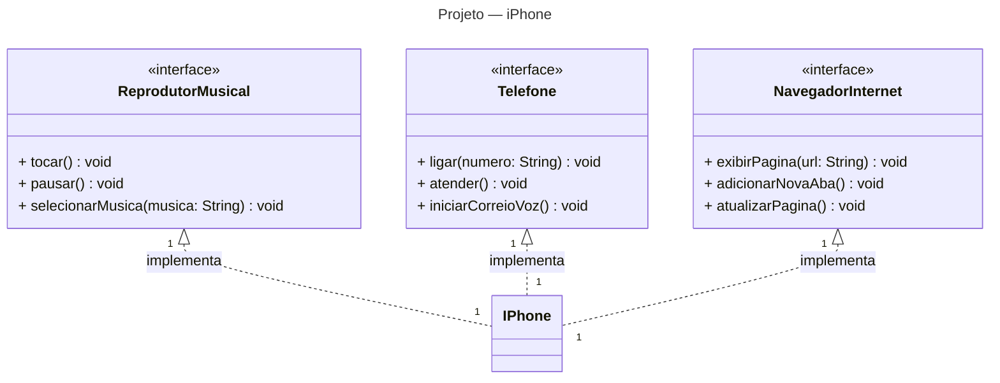

# DIO | Desafio: Utilizando POO para Montar um iPhone

Este repositório tem a finalidade de armazenar o projeto proposto pelo desafio da DIO, que consiste em representar o conceito do iPhone apresentado por Steve Jobs em 2007, utilizando o paradigma de programação orientada a objetos e ferramentas de diagramação para a elaboração do projeto.  

## Ferramenta Escolhida para Montar o Diagrama UML do Projeto

Nesta seção encontra-se o diagrama UML elaborado com base nas instruções do desafio e no vídeo de apresentação do primeiro iPhone por Steve Jobs.  

Primeiro, modelei o diagrama no diagram.net (Draw.io), aproveitando minha experiência prévia com a ferramenta.  

Posteriormente, descobri uma ferramenta de diagramação chamada Mermaid, que renderiza diretamente em Markdown, o que oferece maior praticidade ao manter tudo integrado ao Markdown.

## Diagrama UML do Projeto

## Fontes

- [Repositório do desafio proposto pela DIO.](https://github.com/digitalinnovationone/trilha-java-basico/tree/main/desafios/poo)
- [Steve Jobs apresenta primeiro iPhone legendado (2007)](https://www.youtube.com/watch?v=9ou608QQRq8)
