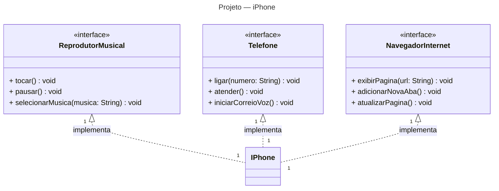

# DIO | Desafio: Simulando Uma Conta Bancária Através Do Terminal/Console

Este repositório tem a finalidade de armazenar o projeto proposto pelo desafio da DIO de representar o conceito do iPhone apresentado por Steve Jobs em 2007 usando o paradigma de programação orientada a objetos e ferramentas de diagramação para a elaboração do projeto.  

## Ferramenta Escolhida para Montar o Diagrama UML do Projeto

Nesta seção se encontra o diagrama UML feito com base das instruções passadas pelo desafio e no video de apresentação do primeiro iPhone apresentada por Steve Jobs.  

Primeiro, eu modelei o diagrama no diagram.net por ja ter uma experiencia de uso da ferramenta, após a modelagem do diagrama UML feita no diagram.net, acabei descobrindo uma ferramenta de diagramação que renderiza diretamente para o Markdown chamada Mermaid, que no fim acabou sendo da minha escolha utiliza-lá para melhor praticidade, já que tudo estará em Markdown.

## Diagrama UML do Projeto

## Fontes

- [Repositório do desafio proposto pela DIO.](https://github.com/digitalinnovationone/trilha-java-basico/tree/main/desafios/poo)
- [Steve Jobs apresenta primeiro iPhone legendado (2007)](https://www.youtube.com/watch?v=9ou608QQRq8)
